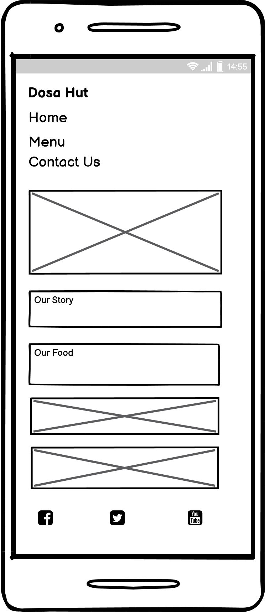
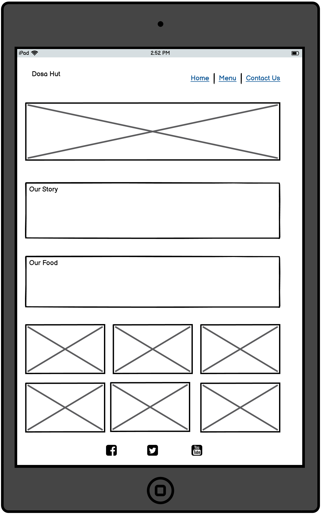
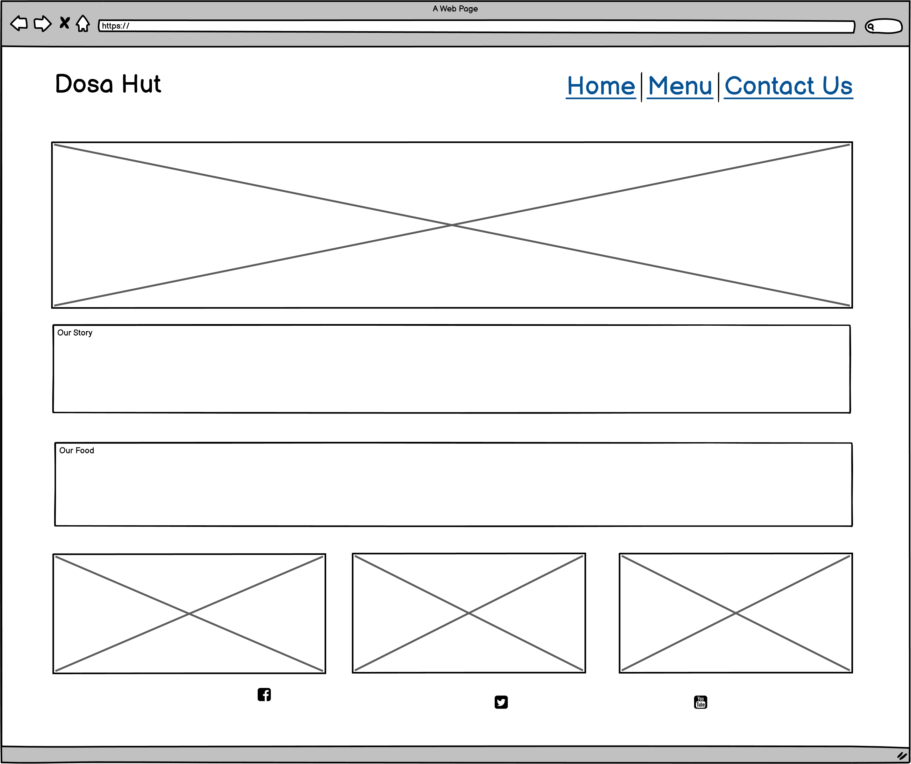

View live website [here.](https://pavithra-veeramani.github.io/restaurant/)
# Dosa Hut
Welcome!
Dosa Hut is a fictitious family owned restaurant which was founded in 2010.
In Indian cookery, a dosa is a crisp savoury pancake.
We are one of the popular restaurants in the town for making crispy dosas.
We mainly focus on quality, customer satisfication and fulfilling their needs.
Our chefs are experts in making all varieties of Indian foods, dosas in particular, sweets and savouries.

   

  # **User Experience (UX)**
  
User experience design plays a important role to attract new customers, boost sales, and create good reputation.

  <h3><strong>Website objective:</strong></h3>
  The objective of this website is to give a simplified user experience in getting the restaurant's menu information, contact details and table booking process.

  

  The navigation bar is simple with three menu items: Home, Menu, and Contct Us. The foreground and background colors are selected having people with visual impairment also in to consideration. 
  

  

  Website is scannable with attractive fonts and visuals. On repeat visits the user can accomplish repetitive tasks quickly and easily.
  

  

  The site is discoverable and users can accomplish their tasks the first time they visit.
  

  
  -	# **User Goals**
      The main goal of this website is to provide  a customer experience that encourages repeat business. Another major objective of a restaurant is to create a sense of loyalty in their patrons to make them regular customers.
      

  -	# **User Expectations**
     <ul>
       <li>
       The site structure is designed considering the expectation of users to be simple and easy to use.     
       </li>
       <li>
       The user interface is easy to navigate (inlcude main navigation bar, footer with social media icons and
       book a table link.)
       </li>
       <li>
       Responsive design for all screen/device sizes like mobile, tablet and desktop.
       </li>
       <li>
       Book a table link is provided where the users can fill the form and submit it.
       </li>
     </ul>
      

  -	# **Color Scheme and Font**
    <ul>
      <li><strong>Colour Scheme</strong></li>
      <ol type="a">
      <li>Colors used in the website are Goldenrod(rgb - 218,165,32) and Black.</li>
      </ol> 
    </ul>
    <ul>
      <li><strong>Font</strong></li>
      <ol type="a">
      <li>The font used are 'Playfair display' as the primary font and 'Source sans pro' as the secondary font.
      </li> 
      </ol>
    </ul>
    

  - # **Images**
      All images for this website were downloaded from
    <ul> 
     <li><a href="https://pixabay.com/">Pixabay</a></li>
     <li><a href="https://www.pexels.com/">Pexels</a></li>
    </ul>
    

  - # **Audio and Video**
    <ul>
     <li>Audio and video plays a vital role in website design. It enhance the site and provides great user experience to the users.</li>
    </ul>
    

  - [Site skeleton (wireframes)](#wireframes)
    [Balsamiq](https://balsamiq.com/) was used to create wireframes for the website.For this project, I created three
    different wireframes for three different devices. Balsamiq wireframe is used to create outline of the website.  
   
   

  
  
  
     

   
   # **Frameworks, Libraries & Programs Used**
  <ul>
    <li><a href="https://fonts.google.com/">Google Fonts</a> - Google fonts was used to import the fonts in the style.css which is used throughout the project.</li>
  </ul>
  <ul>
  <li><a href="https://fontawesome.com/">Font Awesome</a> - Font Awesome was used in the footer to navigate social media links which serves as a user-centered design.</li>
  </ul>
  

# **Project plan**
I created a list of story items before starting development work. Googlesheet was used to maintain the list with description, target date, status and priority. The story items were both functional and technical tasks. <a href="https://docs.google.com/spreadsheets/d/1pRZyCN0FQD6l_kOCmg2Lx3cr5kEttCqoUYaKoG-ZjzA/edit?usp=sharing">Here </a> is a link to the stories.

# **Development and Technical approach**
  GitPod was used for rapid development and was able to quickly see the feedback in some kind of a hosted server.
  <ul>
    <li>Navigation menu - flex display</li>
    <li>Gallery responsiveness - Viewport width approach. The width for the images will be decided by the width of the device's screen</li>
    <li>Google map - Embedded link and iFrame</li>
    <li>Form - Contact Us form sibmitted to https://formdump.codeinstitute.net</li>
  </ul>

# **Testing**

  <ul>
    <li>
      I tested this website and it works in different browsers like Chrome, Safari and Firefox
    </li>
    <li>
      I have confirmed that this project is responsive, looks good and functions on all devices such as Desktop, Laptop, Tablet and Mobile phones.
    </li>
    <li>
      I have confirmed that the navigation,header,Home,Menu and contact us are all readable and understandable.
    </li>
    <li>
      I have confirmed that the form works,requires entries in every field.
    </li>
  </ul>

### Responsive Tools

In order to make sure that design web pages are responsive to all device sizes, [Am I Responsive](http://ami.responsivedesign.is/) site was used to check it. 

### W3C Validator Tools

[W3C Markup](https://validator.w3.org/) was used to check for any errors within all HTML pages.

[W3C Markup](https://jigsaw.w3.org/css-validator/) was used to check for any errors within CSS file.

### Chrome Performance check

Lighthouse feature in Chrome was used to check the performance of the page and all the pages were reported to have more than 85% performance.
 <ul>
    <li>index.html - 86%</li>
    <li>food-menu.html - 99%</li>
    <li>contact-us.html - 99%</li>
  </ul>

### Known bugs

<ul>
  <li>Social media icons not properly aligned to the centre in the Footer.
  </li>
  <li>Contact us form fields not properly padded in mobile device.
  </li>
</ul>

 # **Features**
 # **Navigation**
  <ul>
  <li>The navigation bar contains Home, Menu and Contact-us located in the right corner and the logo in the left corner.
  </li>
  <li>The navigation links are styled with text-decoration. So the user can recognise the active page.</li>
  </ul>
  

  # **Home**
  <ul>
  <li>Home page contains our story which outlines the story of the restaurant and our food section outlines the nature and quality of the food.</li>
  <li>Gallery section includes images which attract potential customers and generate more sales too. </li>
  </ul>

  
  

   # **Menu**
   <ul>
   <li>
   Menu page contains special menu section which lists different dishes and book a table link that links to the contact us page. 
   </li>
   <li>
   video of the food preparation is included in the middle of the page. Videos keep your audience interested and engage them with your content.
   </li>
   </ul>

   
    

   
   

   # **Contact Us**
   <ul>
   <li>Contact us page contains form to get input from the user and a map to navigate to the desired location. 
   </li>
   </ul>

   
    

   

  # **Deployment**
  ### **GitHub Pages**
  
The website was deployed in to GitHub Pages by following the below steps.

  ### **Step 1**
  
Open git hub, We can see list of repositories on the left side. Click the one that is created for Dosa Hut project.

  #### **Step 2**
  
Select the settings and scroll down to the git hub pages section. Click where it says none and select "main". 
  Once we've selected our branch name, we  can click "save". This will refresh the page.

   #### **Step 3**
  
We need to scroll down to the git hub pages section to get our deployed link.

  # **Acknowledgements**
   Thanks to my mentor Marcel Mulders for his support and feedback.
   
   Thanks to the tutor support in code institute for their support.
